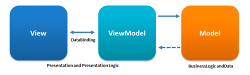
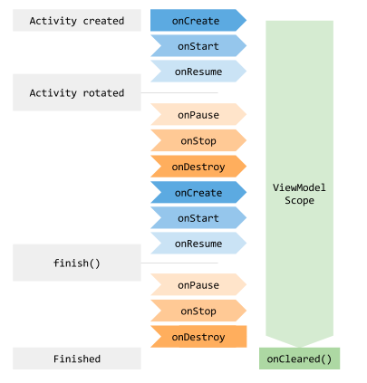

# MVVM Practice Repository

---
## [MVVM 패턴의 구성 요소](https://ko.wikipedia.org/wiki/%EB%AA%A8%EB%8D%B8-%EB%B7%B0-%EB%B7%B0%EB%AA%A8%EB%8D%B8)
- 모델(Model)
  - 모델은 실제 상태 내용을 표현
  - 도메인 모델을 참조하거나 내용을 표현하는 데이터 접근 계층을 참조한다.
- 뷰(View)
  - 모델-뷰-컨트롤러(MVC)와 모델-뷰-프리젠터(MVP) 패턴에서와 같이, 뷰는 사용자가 화면에서 보는 것들에 대한 구조, 배치, 외관에 해당한다.
  - 모델을 보여서 표현하고 사용자와 뷰의 상호 작용을 수신하여, 이에 대한 처리를 뷰와 뷰 모델의 연결을 정의하고 있는 [데이터 바인딩](https://ko.wikipedia.org/wiki/%EB%8D%B0%EC%9D%B4%ED%84%B0_%EB%B0%94%EC%9D%B8%EB%94%A9)을 통해 뷰 모델로 전달한다.
- 뷰 모델(View Model)
  - 뷰 모델은 공용 속성과 공용 명령을 노출하는 뷰에 대한 추상화이다.
  - MVC 패턴의 컨트롤러나 MVP 패턴의 프리젠터를 대신하여, MVVM은 바인더를 가지고 있는데, 이는 뷰 모델에 있는 뷰에 연결된 속성과 뷰 사이의 통신을 자동화 한다.
  - 뷰 모델은 모델에 있는 데이터의 상태이다.
  - 뷰 모델은 MVP의 프리젠터와는 다르게 뷰에 대한 참조를 가지고 있지 않다.
    - 그 대신, 뷰는 뷰 모델의 속성에 직접 연결된 채로 업데이트를 주고 받는다.
  - 효율적인 사용을 위해 바인딩 기술 또는 바인딩을 하는 상용구 코드의 자동 생성이 필수이다.

---
## 바인더(Binder, 연결자)
- MVVM 패턴에서는 선언적인 데이터와 명령-바인딩이 내재되어 있다.
- 바인더는 뷰 모델과 뷰의 동기화를 위해 상용구 로직을 작성해야 하는 의무에서 개발자를 해방시켜 준다.

---
## View Model

- 뷰 모델은 액티비티가 종료될 때까지 유지된다.
- 하지만 Lifecycle이나 view, activity context를 참조하면 메모리 누수가 발생하기 때문에, 이러한 객체를 참조해서는 안된다.
- LiveData와 같은 LifecycleObserver들을 포함할 수 있지만, LiveData와 같이 수명 주기를 인식하는 Observable의 변경사항을 관찰하면 안 된다.
- Context가 필요하다면 AndroidViewModel을 상속하여 application 생성자를 사용하면 된다.

❗️ ViewModel은 생명주기의 영향을 받지 않고 데이터를 유지, 보관하기 위해 사용한다고 볼 수 있다.

---
## LiveData란?
- 액티비티나 프래그먼트의 생명주기를 알고 있는 간단한 Observable이다.
- Observer 패턴을 구현하기 위해 사용된다.
- 일반적으로 ViewModel과 함께 사용된다.
- 수명주기를 수동으로 처리하지 않아도 되며, 메모리에 대한 누수가 사라진다.